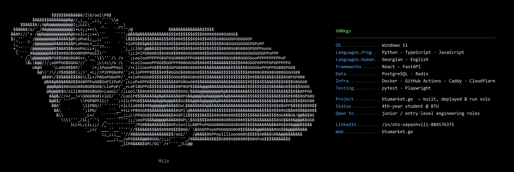

**Oto Sepashvili** — Full-Stack Developer

### Currently building

**[btumarket.ge](https://btumarket.ge)** — a marketplace where every account belongs to a
verified student at one university. Designed, built, deployed and operated solo:
React/TypeScript frontend, FastAPI/PostgreSQL backend, Redis-backed real-time chat,
Docker Compose deploy behind Caddy and Cloudflare, CI on every push.
→ [`600kgs/btumarket`](https://github.com/600kgs/btumarket)

### Stack

### Reach me

